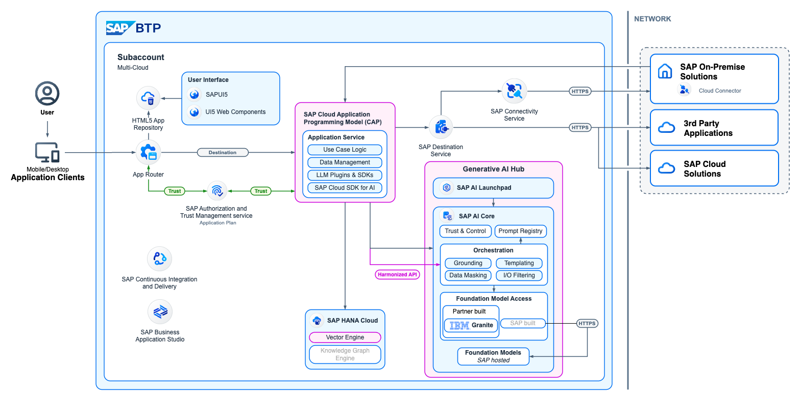
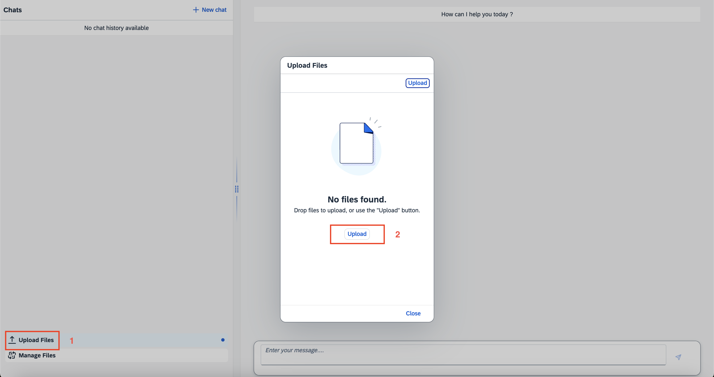
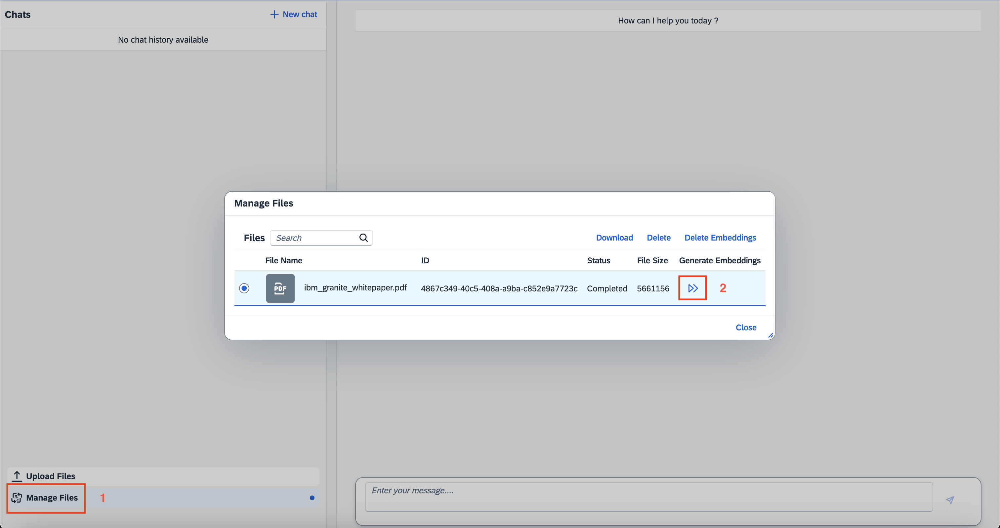
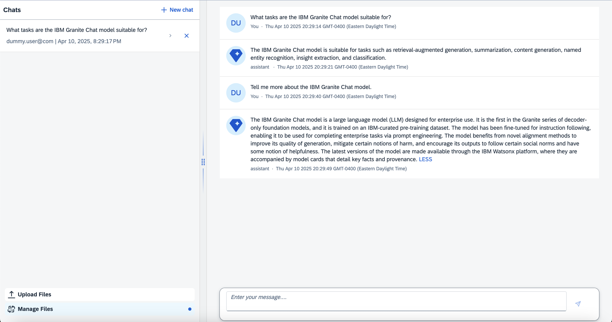

# Build enterprise GenAI applications powered by IBM Granite models leveraging SAP HANA Cloud & Generative AI Hub
#### Discover how IBM Granite models can be seamlessly integrated with SAP HANA Cloud & Gnerative AI Hub on SAP Business Technology Platform (BTP) for RAG (Retrieval-Augmented Generation) and other GenAI use cases.
---

Optimized for enterprise GenAI and RAG, the [IBM Granite 13 Billion Chat V2](https://www.ibm.com/docs/en/watsonx/w-and-w/2.0.x?topic=models-granite-13b-chat-v2-model-card) model offers differentiating values in transparency, performance, and efficiency, which enhances the functionality of chatbots, virtual assistants, and Q&A systems. Combined with SAP BTP & HANA Cloud infrastructure and SAP’s domain-specific data in areas like finance, HR, supply chain, and CRM, enterprises can unlock the potential value of their data to realize the transformative benefits of generative AI for business in the cloud with speed and efficiency.

In this Discovery Center Mission, we have ready-to-consume assets to show how you can quickly build a RAG system for a Q&A chatbot that can generate grounded answers based on curated datasets such as a PDF corpus. The chatbot is an [SAP CAP](https://cap.cloud.sap/docs/about/) application that can be easily deployed on SAP BTP. It leverages a vector database in SAP HANA Cloud and the Granite model through [Generative AI Hub in SAP AI Core](https://help.sap.com/docs/sap-ai-core/sap-ai-core-service-guide/generative-ai-hub-in-sap-ai-core-7db524ee75e74bf8b50c167951fe34a5).



The Cloud Application Programming Model (CAP) is a framework of languages, libraries, and tools for building enterprise-grade cloud applications. This CAP application showcases a Q&A RAG use case, where users can upload and interact with their documents in a low-code setting. It leverages the [CAP LLM Plugin](https://www.npmjs.com/package/cap-llm-plugin) to seamlessly tap into the capabilities of [SAP HANA Cloud vector engine](https://help.sap.com/docs/hana-cloud-database/sap-hana-cloud-sap-hana-database-vector-engine-guide/sap-hana-cloud-sap-hana-database-vector-engine-guide) and access the LLM capabilities offered by Generative AI Hub in SAP AI Core.

### Prerequisites

- SAP BTP Enterprise Account
- [Create an SAP AI Core service instance](https://help.sap.com/docs/sap-ai-core/sap-ai-core-service-guide/create-service-instance), make sure it's enabled with an **Extended** Service Plan, and [create a Service Key](https://help.sap.com/docs/sap-ai-core/sap-ai-core-service-guide/create-service-key) for the service instance
- [Create an SAP HANA Cloud service instance](https://developers.sap.com/tutorials/btp-app-hana-cloud-setup.html) with Vector Engine (QRC 1/2024 or later)
- Create an [orchestration deployment](https://help.sap.com/docs/sap-ai-core/sap-ai-core-service-guide/create-deployment-for-orchestration?locale=en-US) for the chat model `ibm--granite-13b-chat` in the default resource group in in Generative AI Hub
- Create a [foundation-models deployment](https://help.sap.com/docs/sap-ai-core/sap-ai-core-service-guide/create-deployment-for-generative-ai-model-in-sap-ai-core?locale=en-US) for the embedding model `text-embedding-ada-002` in the default resource group in Generative AI Hub
- Install [Cloud Foundry CLI](https://help.sap.com/docs/btp/sap-business-technology-platform/download-and-install-cloud-foundry-command-line-interface) with [MultiApps CLI Plugin](https://help.sap.com/docs/btp/sap-business-technology-platform/install-multiapps-cli-plugin-in-cloud-foundry-environment)
- Install [Node.js and npm](https://docs.npmjs.com/downloading-and-installing-node-js-and-npm)
- Install [Cloud MTA Build Tool](https://sap.github.io/cloud-mta-build-tool/download/)


## Connect to SAP BTP subaccount

Login to your SAP BTP subaccount with the `cf` commands:

```shell
cf api <subaccount-endpoint>
cf login --sso
```

**Note**: You can find the so-called `<subaccount-endpoint>` by looking for the API Endpoint of the Cloud Foundry Environment of your CF subaccount.

## Install Node.js modules

This sample application has been tested on **Node** `v20.18.1` and **npm** `10.8.2`. You can install the modules with the following `npm` command:

```shell
npm install --save
```

**Note**: If you get an error with `@sap/cds-dk`, install it as following: `npm install -g @sap/cds-dk`

## Deploy on SAP BTP

### Update the Generative AI Hub configurations

Edit the `mta.yaml` file and replace `genai-demo` with the name of your existing AI Core service instance:

```yaml
...
# ------------------------------------------------------------
  - name: chatui-aicore-service
# ------------------------------------------------------------
    type: org.cloudfoundry.existing-service
    parameters:
      service: aicore
      service-name: genai-demo
      service-plan: extended
...
```

Edit the `package.json` file to update the destination and model configuration as shown in the following example:

```json
{
  "name": "chatui-app",
  ...
  "cds": {
    "requires": {
      "stream_compat": true,
      "db": "hana",
      "gen-ai-hub": {
        "chat-model": {
          "modelName": "ibm--granite-13b-chat",
          "model_params": {
            "temperature": 0,
            "max_tokens": 500,
            "repetition_penalty": 1
          }
        },
        "embedding-model": {
          "destinationName": "GenAIHubDestination",
          "deploymentUrl": "/v2/inference/deployments/ded784f4215c2b52",
          "resourceGroup": "default",
          "apiVersion": "2024-02-15-preview",
          "modelName": "text-embedding-ada-002"
        }
      },
      "GenAIHubDestination": {
        "kind": "rest",
        "credentials": {
          "destination": "aicore-destination",
          "requestTimeout": "300000"
        }
      },
      ...
    },
    ...
  }
}
```

**Note**:
- You need to configure at least one chat model and one embedding model supported by the CAP LLM Plugin. See the [documentation](https://github.com/SAP-samples/cap-llm-plugin-samples/tree/main/docs) for more details.
- Make sure to replace the ID of the deployment in the `deploymentUrl` in the example above.


### Run CDS build tasks

Run the following `cds build` command to prepare the required artifacts for the deployment:

```shell
cds build --production
```

### Build a multitarget application (MTA) archive

You can build a deployment-ready multitarget application (MTA) archive `.mtar` file from the artifacts of an MTA project according to the project’s MTA development descriptor `mta.yaml` file.

Run the following `mbt build` command to generate the `.mtar` file in the `mta_archives` directory:

```shell
mbt build
```

### Deploy to Cloud Foundry

Finally, you can deploy the generated archive to Cloud Foundry:

```shell
cf deploy mta_archives/chatui-app_1.0.0.mtar
```

This process may take a few minutes and finally create a log output like this:

```log
...
Application "chatui-app-srv" started and available at "[org]-[space]-chatui-app-srv.cfapps.***.hana.ondemand.com"
...

```

To list the deployed multitarget applications, run the following command:

```shell
cf mtas
```

To access the web UI of the deployed application, navigate to your subaccount in SAP BTP cockpit, open the `HTML5 Applications` page , search for application name `chatui`, and click on it. The application should now open up in a new browser tab.

### Create a Destination

An HTTP Destination needs to be created in the deployed destination service `chatui-app-destination-service` at this point.

Create a file named `aicore-destination.txt` like the example bellow:

```
# Destination: aicore-destination
Name=aicore-destination
Type=HTTP
Description=SAP AI Core deployed service (generative AI hub)
URL=https://api.ai.prod.***.hana.ondemand.com
ProxyType=Internet
Authentication=OAuth2ClientCredentials
clientId=sb-xxxxxxxx-xxxx-xxxx-xxxx-xxxxxxxxxxxx!xxxxxxx|aicore!xxxx
clientSecret=xxxxxxxx-xxxx-xxxx-xxxx-xxxxxxxxxxxx$***
tokenServiceURLType=Dedicated
tokenServiceURL=https://***.authentication.***.hana.ondemand.com/oauth/token
## Additional Properties:
HTML5.DynamicDestination=true
URL.headers.Content-Type=application/json
URL.headers.AI-Resource-Group=default
```

**Note**: You can find the credential and URLs in the Service Key of the AI Core instance.

Navigate to the Space in the BTP cockpit, click on the destination service instance `chatui-app-destination-service` in the `Instances` section. Open the `Destinations` page, click on `Import Destination` and choose the `aicore-destination.txt` file you just created. Check to make sure the configuration is correct, and Click `Save`. A new Destination called `aicore-destination` should be created.

Now, the Chat UI should fully function with connectivity to the models deployed in Generative AI Hub.

### Use the application to chat with your documents

The Chat UI application enables natural language interaction with your own documents through a RAG pipeline. You can upload the documents, which are processed using the embedding model and SAP HANA Cloud vector engine to generate semantic embeddings and store them in a vector database. These embeddings allow generative AI models, such as IBM Granite 13B Chat, to understand document contexts and relationships. Therefore, the application can respond to user queries with answers generated by the model based on the relevant document sections retrieved from the vector database.

* Upload your documents in the UI:

  

  **Note**:
    - For your convenience, a sample PDF file for the [IBM Granite Foundation Models Whitepaper](documents/ibm-granite-foundation-models-whitepaper.pdf) is provided.
    - Currently only unencrypted PDF documents are supported. You can enhance the application to support additional documents as well.
    - Please ensure the filename doesn't include spaces.

- Generate the embeddings for the documents:

  

- Interact with the documents in the chat UI:

  


## Hybrid testing

CAP provides [hybrid testing](https://cap.cloud.sap/docs/advanced/hybrid-testing) capabilities for you to run your application in a local development environment while connecting to some cloud services, instead of using local databases or mocks. It helps to avoid long turnaround time of the application deployment, by selectively connecting to services in the cloud. You can follow the steps bellow to test this CAP application in the hybrid mode.

### Configure the UI

In the file `app/hr-approval-ui/webapp/controller/App.controller.js`, make the following change:

```javascript
sessionStorage.setItem("isDeployedVersion", "false");
```

### AI Core service binding

Bind your existing SAP AI Core service instance to the CAP application as follows:

```sh
cf create-service-key <ai-core-service-instance-name> HybridTestKey
cds bind -2 <ai-core-service-instance-name>:HybridTestKey
```

**Note**: Replace `<ai-core-service-instance-name>` with the the the actual name of the service instance.


### Bind the HDI container service instance to the CAP application

Optionally, you can create a new HDI container (hana) service instance as follows. Otherwise, use the one that's already been created.

```shell
cf create-service hana hdi-shared chatui-app-db
```

Run the following commands to create a service key for the HDI container service instance and bind it to the application:

```shell
cf create-service-key chatui-app-db HybridTestKey
cds bind -2 chatui-app-db:HybridTestKey
```

**Note**: Please wait for the service instance and service key creation to complete before you run the next command, which may takes some time.

### Bind the destination service instance to the CAP application

Optionally, you can create a new destination service instance as follows. Otherwise, use the one that's already been created.

```shell
cf create-service destination lite chatui-app-destination-service
```

Run the following commands to create a service key for the destination service instance and bind it to the application:

```shell
cf create-service-key chatui-app-destination-service HybridTestKey
cds bind -2 chatui-app-destination-service HybridTestKey
```

**Note**: Please wait for the service instance and service key creation to complete before you run the next command, which may takes some time.

### Build the artifacts and deploy to SAP HANA Cloud

Run the `cds build` command to create the required artifacts, and then deploy to SAP HANA Cloud with the `cds deploy` command as follows:

```shell
cds build --production
cds deploy --to hana:chatui-app-db
```

### Run the application

Now, you can run your CAP application locally using the cloud service bindings.

```shell
cds watch --profile hybrid
```

**NOTE**: The `cds watch` command automatically restart the CAP application when changes are made to the project files, streamlining and accelerating the development workflow. 


Open `http://localhost:4004` in the browser, and click on `/chat-ui/webapp` under `Web Applications`. Unlike the cloud deployment to BTP, we use the following credential configured in `package.json` for user login in hybrid testing:

```
user: dummy.user@com
password: initial
```


## Undeploy the application

You can undeploy the `chatui-app` application and delete all the Service Keys and Services from your subaccount with the following command:

```shell
cf undeploy chatui-app --delete-services --delete-service-keys
```

